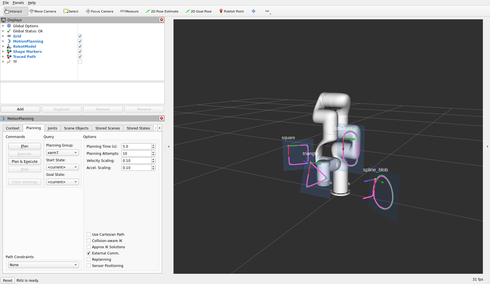
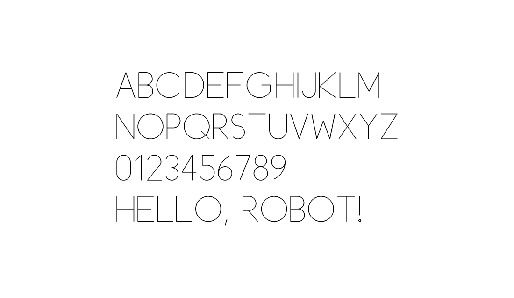

# avatar_challenge — drawing 2D shapes in 3D with an xArm 7

Reads a set of 2D shapes from YAML and traces them in the air with a simulated
UFactory xArm 7, holding the tool normal to each shape's plane and using the
arm's redundant 7th degree of freedom to pick the cheapest way to draw each one
from wherever the arm happens to be.

```bash
cd ~/dev_ws
colcon build --packages-select avatar_challenge --symlink-install
source install/setup.bash
ros2 launch avatar_challenge start.launch.py
```

`--symlink-install` matters: launch files resolve `config/shapes.yaml` through
the *install* space, and without it `install(DIRECTORY config ...)` copies the
file at build time, so editing a shape has no effect until you rebuild. With
symlinks you build once and every later YAML edit is picked up on the next
launch.

That brings up move_group, the fake ros2_control stack, RViz, and the tracer.
The arm draws the four demo shapes in `config/shapes.yaml`: a square, a
triangle, an arc-based stadium and a closed cubic B-spline.



Green is the commanded outline, magenta is the tool path actually swept during
execution (reconstructed by FK over the executed trajectory), the translucent
blue patch is each shape's plane, and the small RGB triads are the shape frames.
The arm has parked at `home` so the drawings are unobstructed.

| argument | default | meaning |
| --- | --- | --- |
| `shapes_file` | `config/shapes.yaml` | shape program to trace |
| `params_file` | `config/shape_tracer.yaml` | node parameters |
| `plan_only` | `false` | plan and visualise without commanding the arm |
| `autostart` | `true` | `false` brings up the simulation only |
| `use_custom_rviz` | `true` | `false` restores the stock MoveIt RViz config |
| `trace_delay` | `12.0` | seconds to wait for move_group before tracing |

To iterate without restarting the simulation:

```bash
ros2 launch avatar_challenge start.launch.py autostart:=false   # terminal 1
ros2 launch avatar_challenge trace_shapes.launch.py             # terminal 2, re-run freely
```

To have the arm write words instead of tracing a shape file, see
[the `word_writer` node](#writing-words-the-word_writer-node): it takes a string
on a topic and turns it into letters on a plane in front of the robot.

---

## Adding shapes at runtime

The YAML file is read once, at launch. After that the node keeps listening on
`/shape_tracer/add_shapes` for an `avatar_challenge/msg/ShapeArray`, so a shape
generator elsewhere in the system can hand over work without a restart.

### The QoS has to match

> **The subscription is `RELIABLE` + `TRANSIENT_LOCAL`.** A publisher created with
> the default profile offers `VOLATILE`, which is *incompatible* — DDS refuses the
> connection and **not one message is delivered**. There is no error at the
> publisher; you just watch nothing happen.

Transient-local is deliberate: it means a producer that publishes before the
tracer has finished starting up is not lost. Match it on your side and you get
that for free. rclpy will log `offering incompatible QoS` if you get it wrong,
and `ros2 topic info -v /shape_tracer/add_shapes` shows both ends' profiles.

### Three ways to send

**From the command line**, as a smoke test — note the two `--qos-*` flags:

```bash
ros2 topic pub --once \
  --qos-durability transient_local --qos-reliability reliable \
  /shape_tracer/add_shapes avatar_challenge/msg/ShapeArray \
  '{mode: 0, shapes: [{name: cli_triangle, closed: true,
    start: {position: {x: 0.4, y: 0.0, z: 0.35},
            orientation: {x: 0.0, y: 0.707, z: 0.0, w: 0.707}},
    vertices: [{x: 0.0, y: 0.0}, {x: 0.12, y: 0.0}, {x: 0.06, y: 0.104}]}]}'
```

**From a YAML file**, using the bundled helper, which converts units and rpy for
you and already uses the right QoS:

```bash
ros2 run avatar_challenge publish_shapes.py my_shapes.yaml          # append
ros2 run avatar_challenge publish_shapes.py my_shapes.yaml --replace
```

**From your own node** — the case this topic exists for. `scripts/publish_shapes.py`
is a fuller worked example; the minimum is:

```python
from avatar_challenge.msg import Point2D, Shape, ShapeArray
from rclpy.qos import DurabilityPolicy, QoSProfile, ReliabilityPolicy

QOS = QoSProfile(depth=10,
                 reliability=ReliabilityPolicy.RELIABLE,
                 durability=DurabilityPolicy.TRANSIENT_LOCAL)   # must match
pub = node.create_publisher(ShapeArray, "/shape_tracer/add_shapes", QOS)

shape = Shape()
shape.name = "generated_square"
shape.start.position.x, shape.start.position.z = 0.4, 0.35
shape.start.orientation.y = shape.start.orientation.w = 0.7071  # Ry(90 deg)
shape.vertices = [Point2D(x=0.0, y=0.0), Point2D(x=0.1, y=0.0),
                  Point2D(x=0.1, y=0.1), Point2D(x=0.0, y=0.1)]
shape.closed = True

batch = ShapeArray()
batch.mode = ShapeArray.APPEND
batch.shapes = [shape]
pub.publish(batch)
```

Everything left unset inherits the program defaults, which is what the empty
`tool`/`sampling` fields above are doing. `ros2 interface show
avatar_challenge/msg/Shape` prints the full annotated schema.

### What the node will reject

A malformed shape is logged by name and skipped; the rest of the batch is still
drawn, so one typo does not cost a producer nine good shapes. The rules are the
same ones the YAML loader enforces:

- exactly one of `vertices` or `path` — never both, never neither;
- `vertices[0]` must be `(0, 0)`; it *defines* the shape frame origin. At least
  two vertices;
- an `ARC` segment needs `has_center` or a non-zero `radius`; a `CIRCLE` needs
  `has_center`; a `BSPLINE` needs `control_points`;
- `start.orientation` must not be all zeros. A default-constructed
  `geometry_msgs/Quaternion` is fine (`w = 1`); one built from a zeroed array is
  not, and would otherwise normalise to NaN and surface as an unexplained IK
  failure much later.

### How it differs from the YAML

`Shape.msg` mirrors the YAML schema field for field — same `start`,
`vertices`/`path`, `closed`, `tool`, `sampling` — with two differences forced by
the message format:

- **SI units only.** Messages carry metres and radians; the YAML's `units:` block
  exists because YAML is hand-authored, and a message carrying a
  `geometry_msgs/Pose` cannot coherently be in millimetres.
- **Orientation is a quaternion** rather than `orientation_rpy`.
  `publish_shapes.py` shows the conversion.

A message has no absent fields, so `has_tool` / `has_sampling` carry what an
omitted YAML key means: inherit the program defaults. This matters because `0.0`
is a meaningful value for `tool.standoff` (trace on the plane) and
`sampling.blend_distance` (sharp corners), so no sentinel would do.

### Batch semantics

Each publication is one batch: its shapes are ordered and drawn together, so the
draw-order optimisation can reason about all of them at once. A batch that
arrives while the arm is drawing waits its turn rather than interrupting a
half-finished outline. `mode: REPLACE` clears the accumulated markers first;
`APPEND` (the default, and the zero value) leaves earlier drawings on screen.

Shape names become RViz labels and `shape_<name>` TF frames, so they are made
unique across batches — a second `square` is drawn as `square_2`, with a warning.

Because shapes can arrive this way, a missing or unparseable `shapes_file` is no
longer fatal — the node logs the error and comes up empty, waiting for the topic.
To start empty on purpose, point it at a file with a `defaults:` block and no
`shapes:` key; those defaults are then what the shapes arriving on the topic
inherit, exactly as a YAML shape would inherit them.

---

## Writing words: the `word_writer` node

`word_writer` is a producer for the topic above. It subscribes to a
`std_msgs/String` on `~/word`, lays the text out on a plane in front of the
robot, and publishes it to the tracer **one letter at a time**.

```bash
ros2 launch avatar_challenge start.launch.py shapes_file:=""   # terminal 1: sim, nothing drawn
ros2 launch avatar_challenge write_word.launch.py              # terminal 2
ros2 topic pub --once /word_writer/word std_msgs/msg/String "{data: 'HELLO WORLD'}"
```

`ros2 launch avatar_challenge write_word.launch.py word:="HELLO WORLD"` writes
one as soon as it starts, and `letter_height:=0.09 plane_distance:=0.45` are
there too. The node never talks to MoveIt — it only publishes shape messages —
so it costs nothing to restart while the simulation keeps running.



### One message per letter

A `Shape` is a single pen-down outline, and most capitals are not one: E is
three strokes, B is three, A is two. So **a letter is a batch** — every stroke of
it in one `ShapeArray` — and the batches go out in reading order. The tracer
draws batches in the order they arrive, which is what puts the word on the plane
left to right, and it finishes a letter before starting the next one because a
batch that arrives mid-trace waits its turn.

Pacing (`letter_interval`, 0.5 s) is therefore not needed for correctness. It is
there so a 40-letter sentence does not arrive in one burst, and so the letters
appear in RViz at a rate a human can watch.

### The writing plane is parallel to YZ

The plane is `x = plane_distance` in the base frame — normal along X, so
parallel to the base YZ plane. Text is laid out in plane coordinates `(u, v)`:

```
p_base = (plane_distance, -u, v)
```

`u` runs along `-Y` because that is "to the right" for someone standing behind
the robot and looking out along `+X`; `mirror_text: true` flips it for a reader
on the other side. Each letter's shape frame gets `X_S` along `u`, `Y_S` up, and
therefore `Z_S = -X_base`, so `tool.face: into_plane` points the pen away from
the robot, into the plane, exactly like writing on a whiteboard in front of it.
Because the plane is the same for every letter, so is the tool orientation.

### Where a letter goes, and whether the arm can get there

The start position of each letter falls out of three things: the size of the
letter, the letters before it, and what the arm can reach.

- **Size.** Glyphs are drawn in a design box one cap height tall and are scaled
  by `letter_height` (metres per capital). A letter's own `advance` plus the
  font's `letter_spacing` is where the next one starts.
- **Reach.** On a plane at distance `d`, the arm covers a disc of radius
  `sqrt((max_reach - margin)² - d²)` about the shoulder. The writing area is the
  rectangle inscribed in that disc (wide rather than tall, since text wants
  width), clamped above `workspace.min_height` so the bottom line never runs
  into the table. Set `area.derive_from_reach: false` to give the rectangle
  yourself.
- **Wrapping.** A word that would cross the right margin moves to the next line
  intact; a word too long for a whole line is broken at the letter that
  overflows; `\n` forces a break. When the text runs out of lines, the rest is
  dropped with a warning rather than drawn somewhere the arm cannot go.

Before publishing, every letter's ink box is checked against the same reach
sphere, and one that fails is skipped by name. It is a first-order filter — a
sphere about the shoulder, shrunk by a margin — not an IK check; the tracer's
redundancy search remains the authority on whether a pose is solvable. What it
buys is that a bad `area.*` override fails at the writer with a message naming
the letter, instead of halfway through a trace.

### The font

`config/alphabet.yaml` is the alphabet: A–Z, 0–9 and some punctuation, as
strokes on a 100-unit cap-height grid. Lower case is folded to upper case, so
`Hello` and `HELLO` draw the same letters.

The glyphs are geometric — round letters are true circles of radius 50, bowls
are circular arcs — because the tracer samples arcs and circles exactly, so a
real arc draws better than a polyline pretending to be one. Arcs are written by
centre, radius and angle:

```yaml
  "S":
    advance: 50.0
    strokes:
      - segments:
          - {type: arc, center: [24.0, 76.0], radius: 24.0,
             start_angle: 45.0, end_angle: 270.0, direction: ccw}
          - {type: arc, center: [24.0, 26.0], radius: 26.0,
             start_angle: 90.0, end_angle: 225.0, direction: cw}
```

so both endpoints are computed from the circle rather than typed in. That is not
a convenience: the sampler rejects a centre-defined arc whose endpoints disagree
about the radius by more than 0.1 mm, and typing them by hand gets that wrong.
The loader also samples every glyph as it reads it, so a broken stroke is an
error naming the letter at startup rather than a rejected message later.

Two more things keep the letters clean: `sampling.blend_distance` is 0, because
corner rounding would take the point off an A, and `max_segment_length` is 2 mm,
because a 60 mm letter sampled at the shape file's 4 mm looks faceted.

### Seeing it without a robot

`preview_shapes.py` listens on the same topic and renders what it hears into a
PNG, so a shape generator can be checked in a second with no simulation running:

```bash
ros2 run avatar_challenge preview_shapes.py --output /tmp/word.png &
ros2 topic pub --once /word_writer/word std_msgs/msg/String "{data: 'HELLO'}"
```

The image above was made that way. It is a preview, not a second
implementation — the sampling is coarser and it does no corner blending, so
`src/path_sampler.cpp` remains the reference.

---

## The coordinate model: a frame per shape

Every shape is authored in 2D inside its own **shape frame** `S`:

- the origin of `S` is the shape's first vertex — which the brief fixes at
  `(0, 0)`, so it is a validated invariant rather than a convention;
- the **XY plane of `S` is the drawing plane**, so the plane normal is just
  `Z_S`.

`start` in the YAML places `S` in the robot's base frame. Every authored
coordinate then maps back to robot coordinates with a single rigid transform:

```
p_base = T_base_shape · (x, y, standoff)
```

This is what makes the two hard requirements fall out for free:

- **Tool normal to the plane.** "Normal to the plane" is "the tool's approach
  axis is parallel to `Z_S`", which is a property of the frame, not of any
  individual waypoint. The tool orientation is therefore computed **once per
  shape** and shared by every waypoint —
  `R_base_tool = R_base_S · Rx(π) · Rz(spin)`. The `Rx(π)` points the
  end-effector's `+Z` along `−Z_S` ("into the page", like a pen); `tool.face:
  along_normal` drops it.
- **Rotating the shape.** Because the geometry never leaves 2D, changing
  `orientation_rpy` rotates the shape *and* the tool together with no extra
  work. The brief's "angled 45° about Z" is literally `orientation_rpy: [0, 0,
  45]`.

Each shape frame is also published on TF as `shape_<name>`, so the mapping is
directly inspectable in RViz.

`start.orientation_rpy` is fixed-axis roll-pitch-yaw, `R = Rz(yaw)·Ry(pitch)·Rx(roll)`
— the same convention as tf and URDF `<origin>` tags.

---

## Using the 7th degree of freedom

For a 7-DoF arm and a fully constrained 6-DoF task, the inverse kinematics has a
one-parameter family of solutions: the **self-motion manifold**. Every point on
it puts the tool in exactly the same place with the elbow swung somewhere else.
Which point you pick decides

- whether the *whole* shape stays inside the joint limits,
- how far the arm has to travel to get into position from where it is now,
- and how close it drifts to a singularity halfway through the trace.

Solving IK at the first waypoint and starting to draw throws that choice away —
it takes whatever the numeric solver converges to from the current seed.
`RedundancyResolver` (`src/redundancy.cpp`) instead:

1. **lands on the manifold once**, seeding IK from the robot's *current* joint
   state (random restarts only as a fallback);
2. **walks along it in both directions.** `J` is 6×7, so its null space is
   spanned by the last right-singular vector of its SVD. Stepping along that
   vector leaves the tool pose unchanged to first order; re-solving IK for the
   same entry pose cancels the second-order drift. Repeating gives a set of
   genuinely distinct postures for one entry pose;
3. **dry-runs the entire shape from each candidate**, IK-chaining waypoint to
   waypoint exactly the way MoveIt's Cartesian interpolator will, so a
   configuration that dies two thirds of the way round is caught *before*
   anything moves;
4. **scores and ranks** them:

   | term | what it measures |
   | --- | --- |
   | `approach` | weighted joint distance from the current configuration |
   | `path` | weighted joint travel accumulated while drawing |
   | `limits` | worst normalised joint-limit proximity along the trace |
   | `manip` | reciprocal of the worst manipulability `√det(JJᵀ)` on the trace |

   Joints are weighted individually (`joint_weights`, default
   `[2.0, 1.8, 1.4, 1.2, 0.8, 0.6, 0.4]`) because swinging joint 1 drags the
   whole arm through the workspace while spinning joint 7 barely moves anything.
   Candidates that cannot reach the whole outline are pushed behind every
   feasible one and ranked by how far they got.

The winner is commanded as a **joint-space goal**, not a pose goal, so the arm
arrives in the posture that was actually evaluated rather than whatever IK finds
at execution time. Only then does the Cartesian trace run, from that
configuration. If the Cartesian path still comes back short, the next-ranked
configuration is tried (`max_config_attempts`).

The ranking is printed for every shape, which makes the effect visible. From the
demo run — the stadium is reachable, but only from part of its manifold:

```
Shape 'stadium': evaluated 11 configuration(s) on the self-motion manifold
      rank  psi[rad]  spin  reach  approach   path  limits  manip  min|J|   total
         0    -1.400  0.000  1.000     3.852  2.338   0.443  1.359   0.037  10.551
         1    -1.200  0.000  1.000     3.705  2.438   0.418  1.512   0.033  10.719
         2    -1.000  0.000  1.000     3.557  2.640   0.395  1.809   0.028  11.239
         3    -0.800  0.000  0.593     3.409  1.551   0.374  1.901   0.026  1416.379  (incomplete)
         4    -0.600  0.000  0.444     3.264  1.258   0.356  1.981   0.025  1563.850  (incomplete)
         5    -0.400  0.000  0.407     3.122  1.205   0.344  2.307   0.022  1600.947  (incomplete)
         6    -1.600  0.000  0.222     3.999  0.714   0.435  1.122   0.045  1784.979  (incomplete)
         7    -1.800  0.000  0.111     4.145  0.553   0.440  1.041   0.048  1895.842  (incomplete)
```

Only three of the eleven candidates can trace the whole outline. Note ranks 3–5:
they are all *closer* to the arm's current configuration than the winner
(`approach` 3.1–3.4 vs 3.85) and have a lower drawing cost, so a greedy IK seed
would happily pick one — and stall between 40% and 60% of the way round.

### Two redundancy parameters, if you want them

Tracing a shape with a pen only really constrains 5 DoF: the rotation of the
tool *about* the plane normal is task-irrelevant. Setting `tool.free_spin: true`
treats that angle as a second search dimension — the manifold is re-enumerated
at each of `spin_samples` angles and the best configuration across all of them
wins. One spin angle is then held constant for the whole shape, so the tool
still stays rigidly normal to the plane. It is off by default so runs stay
deterministic and match the authored tool pose.

On a square 400 mm out on a vertical plane, enabling it evaluates 112
configurations instead of 21 and settles on a tool roll of 2.09 rad rather than
the authored 0.

### Self-collision

Every candidate configuration, and every waypoint of its dry run, is checked
against a `planning_scene::PlanningScene` built from the robot model, so it
carries the SRDF's allowed-collision matrix. A posture that folds the arm into
itself is discarded during the search rather than rejected later by the
Cartesian planner.

### Ordering multiple shapes

A *set* of shapes has no inherent order, so `optimize_shape_order` (default
true) picks one greedily: at each step it scores every remaining shape's entry
pose from the arm's current configuration and commits to the cheapest. Distance
is measured in weighted joint space, not Cartesian space — two shapes can be
centimetres apart and still need a completely different arm posture. Set it to
false to trace in file order.

---

## Geometry

`vertices` is sugar for a polygon; `path` takes a list of primitives. A shape
uses one or the other.

```yaml
shapes:
  - name: square
    start:
      position: [350.0, -120.0, 350.0]
      orientation_rpy: [0.0, 90.0, 45.0]
    vertices: [[0, 0], [0, 100], [100, 100], [100, 0]]
    closed: true
```

| primitive | fields |
| --- | --- |
| `line` | `to` |
| `arc` | `to` + (`center` \| `radius`), `direction: ccw\|cw`, `large_arc` |
| `circle` | `center`, `direction` |
| `bspline` | `control_points`, `degree`, `periodic` |

- **Arcs** may be given by centre (unambiguous) or by radius with SVG-style
  direction/large-arc disambiguation. The angular step is chosen so that *both*
  the chord length and the sagitta stay within `max_segment_length` and
  `chord_tolerance`.
- **B-splines** are evaluated with de Boor's algorithm, clamped by default or
  wrapped periodically with `periodic: true`. The curve is prepended with the
  current point if the author did not start it there, so outlines stay
  connected.
- **Corner blending** (`sampling.blend_distance`) rounds every tangent
  discontinuity with a quadratic Bézier that starts and ends that far back along
  the neighbouring edges. It is G¹-continuous with both, which is what removes
  the full stop the trajectory would otherwise take at each vertex. It runs on
  the sampled polyline, so it works for line↔line, line↔arc and arc↔spline joins
  alike. Set it to 0 for exact, sharp corners.

Units are per-file and per-shape: `units: {length: m|cm|mm, angle: rad|deg}`.

---

## Execution

Per shape:

1. **transit** — joint-space plan (OMPL RRTConnect) to the chosen configuration
   at the approach pose, one `approach_distance` back along `+Z_S`, so transits
   between shapes never drag the tool across a drawing plane;
2. **trace** — `computeCartesianPath` through descend → outline → retreat, held
   on a single IK branch by the jump threshold;
3. **retime** — `computeCartesianPath` interpolates in configuration space and
   returns a path that is geometrically right but dynamically meaningless, so
   the result is re-parameterised with **TOTG**
   (`TimeOptimalTrajectoryGeneration`) against the real velocity and
   acceleration limits. Its `path_tolerance` rounds corners in joint space,
   complementing the geometric blending upstream;
4. **execute**, then publish the swept tool path as a marker.

Once every shape is drawn the arm returns to the named SRDF state in
`park_state` (default `home`), so it ends somewhere known rather than hovering
over the last outline it traced. Set it to `""` to stay put.

The joint limits TOTG retimes against come from `joint_limits.yaml`, which
reaches the node as `robot_description_planning` — see below.

`plan_only:=true` runs the whole pipeline without commanding the arm. It keeps a
virtual joint cursor across shapes, so the previewed ordering and approach costs
are the ones a real run would see rather than every shape being costed from the
same start pose. The full four-shape program previews in under a second.

---

## Layout

```
avatar_challenge/
├── config/
│   ├── shapes.yaml            # the shape program (documented inline)
│   ├── shape_tracer.yaml      # tracer parameters
│   ├── alphabet.yaml          # the font: A-Z, 0-9, punctuation
│   └── word_writer.yaml       # writer parameters
├── include/avatar_challenge/
│   ├── shape_spec.hpp         # data model
│   ├── path_sampler.hpp       # 2D sampling + the lift into robot coordinates
│   ├── redundancy.hpp         # 7th-DoF search
│   ├── alphabet.hpp           # font model
│   ├── text_layout.hpp        # text -> glyph placements on the plane
│   ├── glyph_shapes.hpp       # placed glyphs -> shape messages
│   └── markers.hpp
├── src/
│   ├── yaml_loader.cpp        # YAML -> ShapeProgram, with unit conversion
│   ├── path_sampler.cpp       # lines, arcs, circles, B-splines, blending
│   ├── redundancy.cpp         # null-space walk, dry-run, scoring
│   ├── alphabet.cpp           # YAML -> Alphabet, validated by sampling
│   ├── text_layout.cpp        # wrapping, line breaks, letter positions
│   ├── glyph_shapes.cpp
│   ├── markers.cpp
│   ├── shape_tracer_node.cpp  # orchestration
│   └── word_writer_node.cpp   # string topic -> one ShapeArray per letter
├── scripts/
│   ├── publish_shapes.py      # publish a shapes YAML on ~/add_shapes
│   └── preview_shapes.py      # render what is published, to a PNG
├── avatar_challenge_launch/
│   └── moveit_params.py       # shared MoveIt config for the launch files
├── launch/
│   ├── start.launch.py        # simulation + RViz + tracer
│   ├── trace_shapes.launch.py # tracer only
│   └── write_word.launch.py   # word_writer only
├── rviz/shape_tracer.rviz
├── docs/rviz.png, docs/alphabet.png
└── test/test_shape_geometry.cpp, test_shape_msg_conversion.cpp, test_alphabet.cpp
```

Published topics: `~/shape_markers` (outlines, planes, shape frames, labels) and
`~/traced_path` (the executed tool path), both latched. Shape frames are also on
TF as `shape_<name>`.

The geometry, YAML and redundancy code is a library (`shape_tracing`) separate
from the node, so it can be tested without a running move_group:

```bash
colcon test --packages-select avatar_challenge && colcon test-result --all
```

The tests cover unit conversion, every primitive kind, arc direction and
large-arc handling, the B-spline convex-hull property, that blending removes the
90° tangent jumps of a square, and that every waypoint lands on the plane with
the tool normal to it.

The font and the layout are covered the same way, and `test_alphabet.cpp` ends
by pushing every glyph through `fromMsg()` and `buildTrace()` — the tracer's own
validator and lift — asserting that each one is accepted, that every waypoint of
every letter lands on one plane parallel to YZ, and that the tool points into
it.

---

## Notes on integrating with the controller workspace

Two things about `~/xarm_ws` are worth knowing, because both cost a debugging
cycle:

- **move_group's robot description is a parameter, not a topic.** Anything that
  builds its own `RobotModel` — `MoveGroupInterface` here, and RViz's MoveIt
  displays — has to be handed `robot_description`,
  `robot_description_semantic`, `robot_description_kinematics` and
  `robot_description_planning` directly. `xarm_moveit_config` builds that set
  inside `_robot_moveit_fake.launch.py` and never exports it, so
  `avatar_challenge_launch/moveit_params.py` repeats the same
  `MoveItConfigsBuilder` call with the same arguments (`dof=7`,
  `robot_type=xarm`, `limited=True`, fake hardware plugin). Keeping the
  arguments identical is what guarantees the tracer plans against exactly the
  robot move_group executes on.
- **The stock launch always starts its own RViz.** `_robot_moveit_common2.launch.py`
  gates that node on a `show_rviz` launch configuration that nothing along the
  include chain sets, so `SetLaunchConfiguration('show_rviz', 'false')` in
  `start.launch.py` propagates into the include and suppresses it. The stock
  config has no MarkerArray display, so the shape markers would otherwise be
  invisible. `use_custom_rviz:=false` restores it.

The IK plugin configured for `xarm7` is KDL, a seed-based numerical solver.
That is a good fit here: the seed *is* the redundancy parameter, which is
exactly what the manifold walk manipulates. Switching to TRAC-IK (commented out
in `xarm_moveit_config/config/xarm7/kinematics.yaml`) would work too, but its
internal randomised restarts make the manifold walk less repeatable.

## Tuning

Everything is in `config/shape_tracer.yaml`. The knobs that matter most:

- `redundancy.samples_per_direction` × `redundancy.null_step` sets how much of
  the manifold gets explored — the default `10 × 0.20 rad` covers roughly ±2 rad
  of elbow swing.
- `redundancy.evaluation_stride` trades search fidelity for speed; every shape
  in the demo evaluates in well under a second at the default of 4.
- `redundancy.w_approach` up, `w_path` down favours postures near where the arm
  already is; `w_manip` up keeps it further from singularities at the cost of a
  longer transit.
- `sampling.blend_distance` in the shapes file controls corner smoothing.
